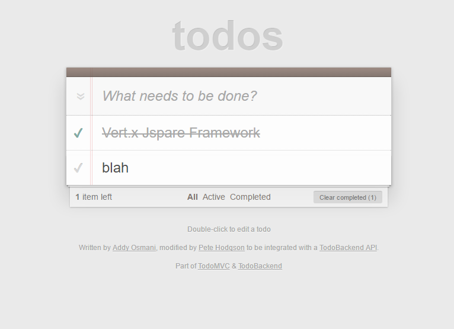

# Vert.x Jspare - Todo Backend

Vert.x Jspare blueprint application - A todo-backend implementation using vertx-jspare-web framework
and JPA persistence

This repository is an introduction to basic Vert.x Jspare Web RESTful service development.

## Contents

- How to develop a REST API using Vert.x Jspare Web
- Zero configuration with Vert.x Jspare AutoConfiguration
- How to use Vert.x Jspare JPA Module
- How to make use of **asynchronous development model**

## Want to improve this blueprint ?

Forks and PRs are definitely welcome !

## Build

To build the code:

    mvn clean install

Run service locally:

- with your ide laucnher: -mainClass org.jspare.vertx.bootstrap.VertxJspareLauncher run org.jspare.vertx.samples.todolist.TodoVerticle
- with Fat Jar `java -jar target/vertx-jspare-todo-blueprint.jar`

## API Test

Test result of the RESTful API (using [todo-backend-js-spec](https://github.com/TodoBackend/todo-backend-js-spec)):

You can also run it with [the todo backend frontend client](http://www.todobackend.com/client/index.html):

